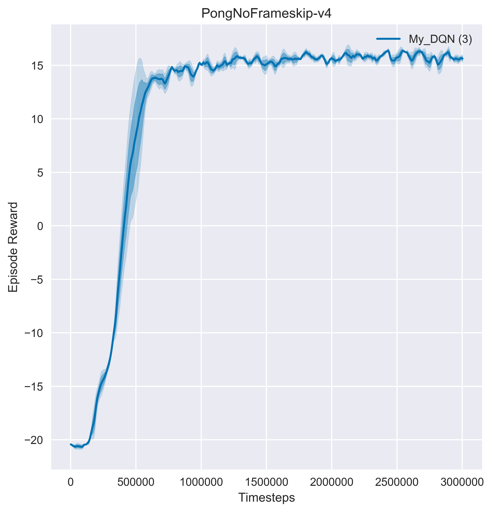

# pytorch-dqn

 This is a simple implementation of the Deep Q-learning algorithm on the Atari Pong environment. 

⚠ my implementation can't reach the best performance

## Requirements

- python >=3.4 

- tensorboardX

- gym >= 0.10

- pytorch >= 0.4

## Papers Related to the DQN

  1. Playing Atari with Deep Reinforcement Learning [[arxiv]](https://www.cs.toronto.edu/~vmnih/docs/dqn.pdf) [[code]](https://github.com/higgsfield/RL-Adventure/blob/master/1.dqn.ipynb)

  2. Deep Reinforcement Learning with Double Q-learning [[arxiv]](https://arxiv.org/abs/1509.06461) [[code]](https://github.com/higgsfield/RL-Adventure/blob/master/2.double%20dqn.ipynb)

  3. Dueling Network Architectures for Deep Reinforcement Learning [[arxiv]](https://arxiv.org/abs/1511.06581) [[code]](https://github.com/higgsfield/RL-Adventure/blob/master/3.dueling%20dqn.ipynb)

  4. Prioritized Experience Replay [[arxiv]](https://arxiv.org/abs/1511.05952) [[code]](https://github.com/higgsfield/RL-Adventure/blob/master/4.prioritized%20dqn.ipynb)

  5. Noisy Networks for Exploration [[arxiv]](https://arxiv.org/abs/1706.10295) [[code]](https://github.com/higgsfield/RL-Adventure/blob/master/5.noisy%20dqn.ipynb)

  6. A Distributional Perspective on Reinforcement Learning [[arxiv]](https://arxiv.org/pdf/1707.06887.pdf) [[code]](https://github.com/higgsfield/RL-Adventure/blob/master/6.categorical%20dqn.ipynb)

  7. Rainbow: Combining Improvements in Deep Reinforcement Learning [[arxiv]](https://arxiv.org/abs/1710.02298) [[code]](https://github.com/higgsfield/RL-Adventure/blob/master/7.rainbow%20dqn.ipynb)

  8. Distributional Reinforcement Learning with Quantile Regression [[arxiv]](https://arxiv.org/pdf/1710.10044.pdf) [[code]](https://github.com/higgsfield/RL-Adventure/blob/master/8.quantile%20regression%20dqn.ipynb)

  9. Hierarchical Deep Reinforcement Learning: Integrating Temporal Abstraction and Intrinsic Motivation  [[arxiv]](https://arxiv.org/abs/1604.06057) [[code]](https://github.com/higgsfield/RL-Adventure/blob/master/9.hierarchical%20dqn.ipynb)

  10. Neural Episodic Control [[arxiv]](https://arxiv.org/pdf/1703.01988.pdf) [[code]](#)
